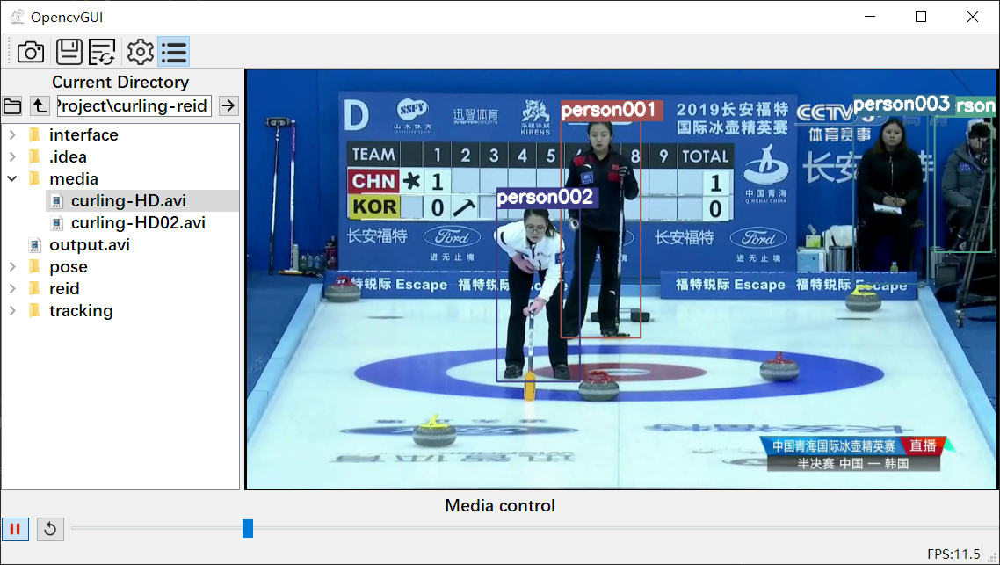

# 冰壶运动运动员重识别系统

## 系统介绍

毕业设计项目，整合了行人检测、跟踪与行人重识别三部分功能的系统，满足多任务场景，可以同时对多个运动员进行识别，具备GUI，可输出视频。

程序界面如图所示：

处理视频时，选择菜单中的目录按钮，左侧弹出的目录中双击选择需要处理的视频即可。

## 程序参考

本系统的GUI界面参考借用了项目[GUI-for-Pose-Estimate-and-Action-Recognition](https://github.com/JiageWang/Openpose-based-GUI-for-Realtime-Pose-Estimate-and-Action-Recognition)

该项目原本是利用了openpose的PythonAPI做姿态检测，本系统中仅使用了视频读取的功能、改写了保存的功能为输出视频文件到output/，由于并未去除原本姿态检测的功能模块，故若有需要可以重新参考pose/下的程序。

> 注意：如果需要使用openpose的PythonAPI，同时你也是在windows环境下使用python3.7版本，可以直接使用我已编译的pythonAPI(openpose/下的文件)，否则请自行根据[openpose](https://github.com/CMU-Perceptual-Computing-Lab/openpose)官方版本进行本地化编译，并选择编译pythonAPI

行人监测与跟踪部分，采用的是项目[pytorch-mot-tracking](https://github.com/afunTW/pytorch-mot-tracking)提供的程序，具体的行人检测使用[YOLOv3](https://github.com/pjreddie/darknet)实现，行人跟踪使用[SORT](https://github.com/abewley/sort)实现。

行人重识别部分是基于[FD-GAN](https://github.com/yxgeee/FD-GAN)的工作，把训练得到的模型，用[open-reid](https://github.com/Cysu/open-reid)提供的估计方法可以得到识别结果。

## Python Dependency

- python 3.7
- numpy==1.16.3
- PyQt5==5.13.0
- opencv-python==4.1.0.25
- torch==1.2.0+cu92（根据自己的系统安装）
- torchvison==0.4.0+cu92
- tqdm==4.32.1
- Pillow==6.0.0

## 模型下载注意事项

模型文件较大，请自行前往[stageIII](https://drive.google.com/drive/folders/1w8xqopW0icA3VIxZyelI9k-Fb8rRCME7)下载best_net_E.pth，放在reid/models/stageIII/目录下，运行tracking/data/下的download_weights.sh或者点击[yolov3.weights](https://pjreddie.com/media/files/yolov3.weights)下载后放在相应目录下。

如果需要姿态检测部分的功能，请运行pose/models/下的getModels.sh或者前往[openpose](https://github.com/CMU-Perceptual-Computing-Lab/openpose)寻找下载模型，并从网盘[3rdparty](https://pan.baidu.com/s/1oQ1uJiqPTN9lOZPPVCGAyA)提取码``pj2p``下载3rdparty文件并解压至对应目录。

## 缺陷与改进方向

(1) 对运动员图像的记录仅限于简单的一段视频序列的图像，一旦出现错误的重识别结果，其记录会立刻污染所记录的图像库，给接下来的重识别造成困难。

(2) 行人检测部分框选出的图像出现问题时，会导致接下来的重识别工作出现偏差，不能及时修正。

(3) 进行重识别工作时，会直接将现有图像全部进行特征提取，再进行距离计算，既没有进行缓存也没有利用之前的处理结果，并未做到数据的充分利用。